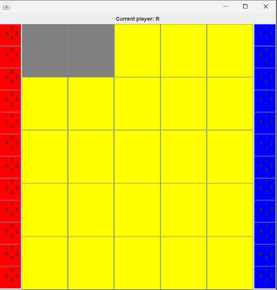
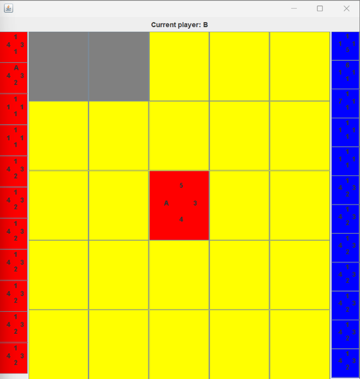

# Three Trios Game
A Java based GUI application that allows for a card game played through player vs. player, AI vs. AI,
or a combination of both.

## Features ✨
- Developed using the model-view-controller pattern using Java 📱
- Utilized abstraction and object-oriented design patterns 🖥️
  - Adapter pattern, Decorator pattern, Observer pattern, and Strategy pattern
- Validated methods work as specified using mocks and JUnit tests 🧪

## Game Instructions
- The goal of this card game is to own the most cards by the time the board is completely
filled up.
  - To count the amount of cards a player owns, add up the amount of cards with the player's
    color on the board and in their hand.
- Player 1 has the Red color and goes first. Player 2 has the Blue color and goes second.
- There are card cells on the board represented by the yellow squares, which are cells the players
  are able to place their cards on.
- There are hole cells on the board represented by gray squares, which are cells neither players
  can place their cards on.
- If a cell on the board already has a card, then no one can place a card on that cell.

##  AI Strategies
- Strategy 1 (Corner Strategy): A strategy where the corners of the grid are selected first
  if they are legal moves. Also, consider which card is the hardest to flip in that corner.
  - Hardest to flip: Sum each card's value that would be adjacent to empty card cells.
    The card with the greatest sum and the corresponding corner are then selected.
  - If no corner available, select uppermost, leftmost available position with card index 0
    (uppermost card in the player's hand as displayed in the GUI).
- Strategy 2 (Flip Most Cards Strategy): A strategy attempting to flip the most cards
  possible in one turn. 
  - If no flips are possible (most flip of 0), then select the uppermost, leftmost open
    position with card index 0. 
- Strategy 3 (Least Exposed Strategy): A strategy where cells that are the least exposed
  are chosen. 
  - For every direction of a card on a cell, count how much cards
    in the opponent's hand can flip the card in that direction. Get the sum and find the
    coordinate of the cell and hand index of the card with the lowest sum.
- Strategy 4 (Min Max Strategy): A strategy that attempts to minimize the effect of the
  opponent's next move.
  - Tries every possible location with every card then guesses the opponent's strategy.
  - Once opponent's strategy is guessed, simulate where the opponent would play next
    based on where this AI would play, and calculate the amount of flips the opponent would
    get as a result of the location and card we picked. The location and card index we pick
    that will result in the fewest amount of flips for the opponent will chosen.

## Card Values
- A card's direction values can either be 2, 3, 4, 5, 6, 7, 8, 9, or A (10)

## Card Flipping Rules
- All rules will compare the newly placed card with neighboring cards with opposing colors.
  - The newly placed card will compare its North Value to North neighbor's South Value.
  - The newly placed card will compare its South Value to North neighbor's North Value.
  - The newly placed card will compare its East Value to North neighbor's West Value.
  - The newly placed card will compare its West Value to North neighbor's East Value.

- Flip Greater Rule: Cards are flipped if and only if the newly placed card has an opposing
  color than its neighbor and a value greater than its neighbor's value.
  - Ex: Newly placed red card's North value is 8, neighbor's blue card South value is 3,
    and newly placed card is directly below neighbor, then flip neighbor blue card's color to red. 

- Reverse Rule: Cards are flipped if and only if the newly placed card has an opposing color
  than its neighbor and a value less than its neighbor's value.

- Fallen Ace Rule: Newly placed cards with greater opposing values overtake cards AND
  1 overtakes Ace. 
  - The reverse is also true (if applied), where newly placed cards with
    smaller opposing values overtake cards AND Ace overtakes 1.

- Plus Rule: Cards are flipped if at least two opposing pairs of adjacent cards have the same sum
  with the current card in their respective opposing directions. 
  - Reversing this rule does nothing.

- Same Rule: Cards with the same opposing values as the card played are flip if and only if at
  least 2 cards satisfy this condition. 
  - The reverse acts functionally the same as the non-reversed version.

## Board Configuration File
- State the number of rows followed by the number of coloumns for the desired board.
- Use C to represent a card cell.
- Use X to represent a hole cell.
- There must be an odd number of card cells.

### Board Configuration File Example
A 3 x 3 grid with only card cells may be a file with these contents: 
3 3 
CCC 
CCC 
CCC 

## Card Configuration File
- State the name of the card followed by the North, South, East, and West values.
  - String int int int int
  - Values are numbers 1 through 10 (inclusive). 
- Each card name must be unique.
- If N = number of card cells on board, then there must be at least N + 1 cards in the card
  configuration file to start a game.

### Card Configuration File Example
A deck of 6 cards may be a file with these contents: 
card1 1 1 1 1 
card2 2 2 2 2 
card3 3 3 3 3 
card4 4 4 4 4 
card5 5 5 5 5 
card6 6 6 6 6 

## Toggle Hint Mode
- For hints to be toggled between on and off, player one would click 'q' and
  player two would click 'w'. For the hints to appear, the user must toggle hints on,
  then click on a card in their hand.
- Hints display the number of potential card flips on each cell based on the selected card.

## Example
- Arguments: human human default 

- Starting Screen: 

 
- Red places a card: 

 
- Blue places a card and flips red: 

 
- Blue flips nothing: 
.")
 
- Red flips multiple cards: 

 

## How to Run 🚀
- Ensure you have JDK 11 or later installed.
- Make sure JUnit 4 is available for testing

1. git clone https://github.com/wong-bria/ThreeTrios.git
2. Open the project in the IDE of your choice.
3. Edit configurations and arguments. (Steps detailed in [Arguments Section](#arguments))
4. (Optional) Create your own board configurations (Steps detailed in [Board Configuration File](#boardconfig))
  - After you have created your board configuration file and placed it in the BoardConfig folder,
    replace 'HoleAndCardCellBoard' with the name of your file from the line 
    'ReadGridConfig readGrid = new ReadGridConfig("BoardConfig/HoleAndCardCellBoard");'
    in the ThreeTrios.java class.
5. (Optional) Create your own card configurations (Steps detailed in [Card Configuration File](#cardconfig))
  - After you have created your own card configuration file and placed it in the CardConfig folder,
    replace 'ForPlus' with the name of your file from the line
    'ReadCardConfig readCard = new ReadCardConfig("CardConfig/ForPlus");' in the ThreeTrios.java class.
6. Click run with configurations.

- After clicking run, two windows will appear on top of each other, so you must drag the windows apart
for both players to see the board. 
- The window that appears on top of the other is player 2's window, and the window below is player 1's window.

## Arguments
- X Y [[A] B]
  - Where X and Y are either "human", "strategy1", "strategy2", "strategy3", or "strategy4"
    (all without the quotes).
    - Refer to [AI Strategies](#strat) Section for details on each strategy.
  - X represents Player 1 and Y represents Player2.
  - "human" represents a human playing, such as yourself.
  - "strategy1", "strategy2", "strategy3", and "strategy4" represents an AI playing
  - The square brackets, [], means that the arguments inside are optional and these arguments
    represents the card flipping rules that will be applied.
    - Arguments A, B can either be "default" (without the quotes) or empty string, "", which will
      both use the Flip Greater Rule, "reverse" to use the Reverse Rule, "fallen-ace" to use the 
      Fall Ace Rule, "same" to use the Same Rule, or "plus" to use the Plus Rule (all without the quotes)
      - Rules Flip Greataer Rule and Reverse cannot be used together as they contradict each other.
      - If Flip Greatear Rule, Reverse Rule, or Fallen Ace Rule aren't used, then Flip Greater 
        Rule will be applied.
      - If arguments A and B are both not given, then Flip Greater Rule will be used.
    - Refer to [Card Flipping Rules](#cardRules) Section for details on each card rule. 

## Codebase Information
The grid a player plays on is 0 index based where the origin starts at (0, 0) in the top left,
and as row increases it moves downward on the grid, and as column increases, it moves right on the grid.
The hands are a list where cards slide left when used.

## Additional Information
I worked in this project with a peer, David Liu.
Code provided to us to practice the Adapter pattern is in the provider folder,
which was given to us by Mateo Biggs and Ayush Adhikari.

### Key components:
Some key components are the file readers, model, and view, and controller.

The controller is the component that will drive the control-flow of our
system. It will handle interactions between the model, view, and user input/output. It also
controls the flow of the game by processing commands, updating game states, and creating outputs
to be displayed.

The file readers are driven by the controller because they are called in the controller's
startGame to create a list of cards and a grid of cells to be used in the game respectively.

The model is driven by the controller since the controller responds to user inputs and makes
requests to the model to either update game states or retrieve data. The model also drives
because when a game state changes, the model notifies the view to update the display.

The view is driven by the model because when the model changes, the view will update itself to
reflect the changes and match the game state in the model.

### Key subcomponents:
In file readers, key subcomponents: ReadCardConfig and ReadGridConfig.
    - ReadCardConfig: It exists to read a card configuration file given by the user, and is
      used to create a list of cards to be played in the game (the deck/each players' hand).
    - ReadGridConfig: It exists to read a grid configuration file given by the user, and
      is used to create a list of list of cells (the board).

In view, key subcomponent: ThreeTrioGameView.
    - ThreeTrioGameView: It exists and is used to display the current game state
      of a game of Three Trios.

In model, key subcomponent: Cells, and Card.
    - Cells: It exists to represent either a card cell or hole cell, and are used to
      build a grid that the user will play on.
    - Card: It exists to represent a card that holds information such as its name,
      color, and attack value in its north, south, east, and west directions.
      It is used to be played on a grid for a user to try and win a game of Three Trios.